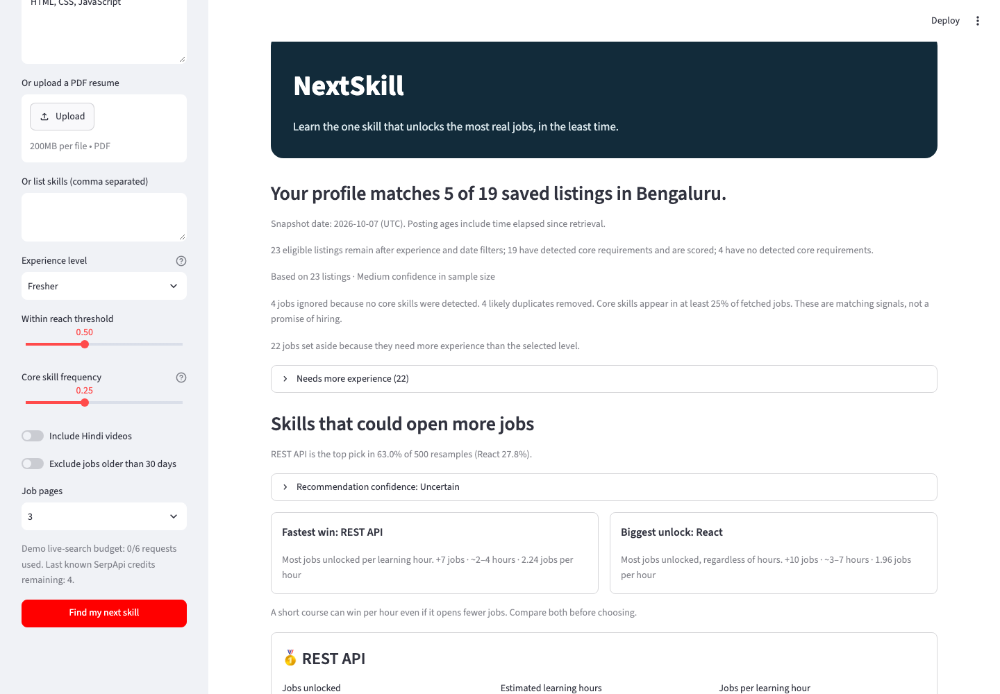
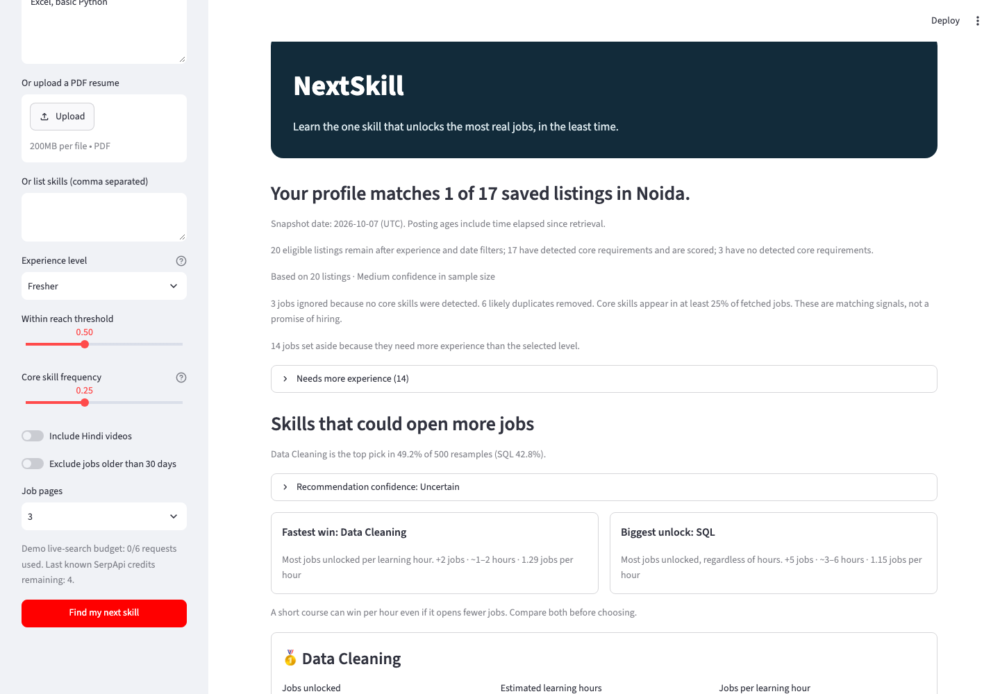
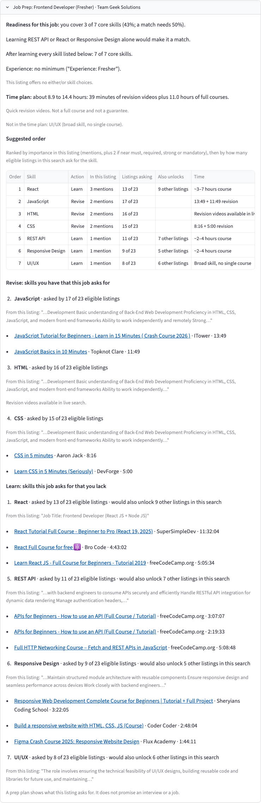
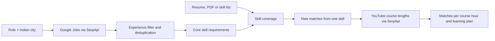

# NextSkill

[](https://github.com/Anand-240/NextSkill/actions/workflows/tests.yml)


**Your next skill, counted from today's jobs in your city.**

Learn the one skill that unlocks the most real jobs, in the least time.

**[Try it live](https://nextskill.streamlit.app)** (saved demo data, no key needed)

Tell NextSkill your skills and your city. It reads local job listings through SerpApi and names the one skill that would let your profile match the most of them for the fewest hours of free courses, with the listings and courses to prove it.

## Key findings

- **A Bengaluru frontend fresher should learn REST API next.** With HTML, CSS and JavaScript, the profile matches 9 of 19 scored Bengaluru listings in the saved demo. About 3 hours of free REST API courses (3.12 hours) would add 8 more matching listings, and the app lists every one of them. React adds the most (10) but takes about 5 hours, so the app shows it next to REST API as the biggest unlock.
- **The app says when it is unsure.** Both demo picks are labelled Uncertain. REST API wins 62.2% of listing resamples in Bengaluru. In the Noida analyst fresher demo, Data Cleaning (+2 at 1.54 hours) edges SQL (+5 at 4.34 hours) on matches per hour but wins only 56.2% of resamples.
- **One listing becomes a prep plan.** For the "Frontend Developer (Fresher)" listing at Team Geek Solutions, the profile covers 3 of 7 core skills; REST API, React or Responsive Design alone would make it a match. Job Prep orders what to revise and learn, quotes the listing, and estimates about 8.9 to 14.4 hours.

> **What the numbers mean**
>
> - **Matches:** the profile covers at least the threshold share (default 50%) of a listing's detected core skills. Not a hiring prediction.
> - **Learning hours:** the length of free full courses found on YouTube. Not time to mastery.
> - **Revision time (Job Prep):** the total length of up to two short revision videos (5 to 25 minutes) per skill you already have. Quick revision videos, not a full course and not a guarantee.
> - **Confidence:** how often the top pick stays first when listings are resampled and course hours vary. Stability, not accuracy.

## Why it exists

Students and early-career applicants often have to guess what to learn. Job descriptions mention many skills, but a long course list does not answer which skill to learn *next*. NextSkill compares a person's current skills with actual listings for a chosen role and city, then shows one-skill recommendations, an ordered learning plan and a prep plan for a chosen listing.

## Try the bundled demo

The bundled Noida and Bengaluru snapshots work **without a SerpApi key** and make no API calls.

```sh
git clone https://github.com/Anand-240/NextSkill.git
cd NextSkill
python3 -m venv .venv
. .venv/bin/activate
pip install -r requirements.txt
streamlit run app.py
```

Open the local URL shown by Streamlit. The Bengaluru frontend demo appears automatically. Choose another role or change the inputs, then press **Find my next skill** to refresh the results. You can replace the sample resume text, enter a comma-separated skill list, or upload a PDF with selectable text. Select an experience level and adjust the match threshold to explore different scenarios. Saved-data results are cached, so repeated demo runs return in well under a second.

| Saved demo persona | Eligible listings | Scored listings | Matches now | Fastest win | Biggest unlock |
|---|---:|---:|---:|---|---|
| Frontend Developer, Bengaluru · HTML, CSS and JavaScript fresher | 23 | 19 | 9 | REST API, +8 | React, +10 |
| Data Analyst, Noida · Excel and basic Python fresher | 20 | 17 | 1 | Data Cleaning, +2 | SQL, +5 |

These job snapshots were retrieved on **2026-10-07 UTC**. Eligible listings pass the experience and date filters; scored listings also have detected core requirements. Matching the threshold does not establish hiring eligibility.





[Bengaluru opportunity curve](screenshots/final_frontend_plan.png) · [Noida opportunity curve](screenshots/final_noida_plan.png) · [Search Replay](screenshots/final_replay.png)

## Job Prep mode

After the recommendations, pick one listing that matches now or is one skill away and press **Prepare for this job**. The plan uses only this search's data: the listing's core requirements, how many eligible listings ask for each skill, and the existing match and unlock calculations. It shows readiness before and after, skills to **revise** and to **learn**, either/or choices in the listing, the exact line that mentions each skill, the listing's experience requirement, and a time range.

Skills are ordered by importance in that listing (mentions, plus 2 when the sentence says must, required, strong or mandatory), then by how many eligible listings ask for them. Learn skills reuse the saved full-course hours. Revise skills get short revision videos from a new YouTube search through SerpApi (`<skill> revision`, 4 to 20 minute filter). The app keeps 5 to 25 minute videos whose title names the skill and suggests revision, and drops other languages and exam coursework. With no such video it says so instead of filling the gap.

Example from the saved Bengaluru demo: for the "Frontend Developer (Fresher)" listing at Team Geek Solutions, React comes first in the plan: the listing mentions it 3 times and 13 of 23 eligible listings ask for it. Revising JavaScript comes next: 17 of 23 listings ask for it, and two saved videos take 26 minutes.

The demo has saved revision videos for JavaScript and CSS only; other skills show "Revision videos available in live search". In live mode the app shows how many new searches a fetch would make, and those searches count toward the live search budget.



## How it works



1. **Collect listings.** Live mode searches Google Jobs for the role and city, up to three pages. Fresher mode also searches fresher and junior versions of the role. The app merges near-duplicate company/title pairs and shows each query in **Search Replay**.
2. **Find core requirements.** A dictionary of about 180 skills extracts named skills from descriptions and resumes. It understands versioned and short names (HTML5, CSS3, ES6, Node, Mongo), stacks (MERN and MEAN expand to their member skills), negation ("no Tableau", "not Angular", "currently learning Power BI") and preferred skills ("Python is a plus", "nice to have: AWS"), which count as nice to have rather than core. A skill is core when it appears in at least **25% of eligible listings** by default. Skills are interchangeable only where the listing offers a choice: "X or Y", a slash, or "A, B or C" with three tools of one family (BI tools, frontend frameworks, cloud providers, databases). Broad labels such as "UI/UX" count for matching but are never recommended as a course.
3. **Count matches.** A listing matches when the profile covers at least **50% of its detected core requirements** by default; the slider is adjustable. Explicit description requirements override title estimates, and "freshers welcome" or "no experience required" override title words such as Lead. The experience levels use the minimum of each band: 0, 1 or 3 years. Listings that need more experience are shown separately. Posting ages add elapsed days since retrieval. Listings with no detected core requirement are marked **Unknown** and left out of match counts.
4. **Rank missing skills.** For each missing core skill, NextSkill counts listings that do not match now but would after adding it, and divides by an estimated course length. The **Fastest win** has the most new matches per course hour; the **Biggest unlock** has the most new matches regardless of hours. Results include the matching listings, posting dates, links, course videos, and a two-skill plan.
5. **Build an opportunity curve.** Starting from current matches, the app repeatedly picks the skill with the most *additional* matches per course hour. It stops after five skills or when no skill adds matches. Only skills with a course duration are used; others appear under **Hours unknown**. A skill-distance chart shows how many listings are zero, one, two, or at least three core skills away.

Course hours are the median length of up to three free YouTube videos with a course-like title and a duration of at least one hour. Titles or channels indicating an unrequested language are excluded before selection and fallback. Unlabelled language remains unknown; this filter cannot verify the audio language. If fewer than two qualify, the app falls back to videos of at least 30 minutes and marks the estimate **low confidence**. The displayed hour range is an approximate 25% band; it is not a promise of mastery.

## What the saved plans show

| Demo | Opportunity-curve points: cumulative hours → matching listings | Greedy vs exact additional matches at 5h / 10h / 15h |
|---|---|---|
| Bengaluru frontend fresher | Current profile: 9; REST API 3.12h → 17; React 8.21h → 19 | 8/8 · 10/10 · 10/10 |
| Noida analyst fresher | Current profile: 1; Data Cleaning 1.54h → 3; SQL 5.89h → 11; Tableau 11.89h → 13 | **2/5** · 11/11 · 12/12 |

For a quality check, NextSkill tries every subset of the top eight measurable missing skills under 5, 10, and 15-hour budgets. These saved demos have **three** measurable candidate skills in Bengaluru and **five** in Noida, so the exact search is small. Exact search beats greedy once: in Noida at five hours, greedy takes Data Cleaning (+2) while SQL alone gives +5. In Bengaluru greedy matches the exact gain at every budget, although at 10 hours React alone reaches the same +10 in fewer hours. Greedy is not guaranteed to find the best combination.

The app resamples eligible listings **500 times** with a fixed seed. REST API wins **62.2%** of Bengaluru resamples (Responsive Design 24.4%); Data Cleaning wins **56.2%** in Noida (SQL 39.0%). It also varies each measured skill's hours independently from **0.75x to 1.5x** in 500 seeded draws, checked at thresholds **0.4 / 0.5 / 0.6**, plus the selected threshold if different. At the default threshold this gives **1,500 checks**: the top pick is retained in **48.5%** for Bengaluru and **86.5%** for Noida.

Recommendation confidence uses the **lower of the two shares**: Strong at 85% or more, Likely at 60% or more, otherwise Uncertain. Both demos are therefore **Uncertain**, and the top card shows a medal only for Strong or Likely picks. These labels measure sensitivity, not accuracy or hiring probability. A separate listing-count badge reports High (25+), Medium (12 to 24), or Low (under 12) sample size.

## Why SerpApi is essential

| SerpApi engine | What NextSkill uses it for |
|---|---|
| [`google_jobs`](https://serpapi.com/google-jobs-api) | Local job titles, companies, descriptions, links, posting signals, and pagination. |
| [`youtube`](https://serpapi.com/youtube-search-api) | Beginner-course search results, video lengths, channels, titles, and links; short revision videos for Job Prep. |
| [Account API](https://serpapi.com/account-api) | The current credit balance in live mode, and credit usage before and after a live run. |

The live product needs current local job and course data; the bundled data exists to make the demo and tests reproducible. Live responses are cached in `cache/`. Searches use a 75-second timeout and do not retry on timeout.

## Questions a judge might ask

**Why not just ask ChatGPT?** An LLM gives generic advice that you cannot check. NextSkill counts today's listings in your city and links every claim to a listing and a course: you can open the 8 Bengaluru listings that REST API would add and the courses behind the 3-hour estimate. The running app does not call an LLM.

**Why only two SerpApi engines?** Google Jobs answers "what do local employers ask for" and YouTube answers "how long is a free course". Those are the two measurements the ranking needs. The Account API only reports credits. Another engine would cost credits on every search without improving either measurement.

**Doesn't matches per hour favour short courses?** Yes, it can. That is why the app shows the **Fastest win** (most new matches per course hour) next to the **Biggest unlock** (most new matches, regardless of hours). In Bengaluru these are REST API (+8 at 3.12 hours) and React (+10 at 5.09 hours). The user can compare both before choosing.

**How big are the samples?** The saved Bengaluru searches returned 49 listings, 45 after removing duplicates. After the experience filter, 23 are eligible and 19 have detected core skills. Noida went from 40 to 34, then 20 eligible and 17 scored. A live search reads up to three pages, plus fresher and junior versions in Fresher mode. The app shows a sample-size badge and warns when fewer than 12 listings remain.

**How was accuracy checked, and what was not measured?** A manual audit of 20 sampled skill matches found 16 correct; after the context filters, the 16 retained matches were all correct. A test file of 47 realistic resume lines (versions, headings, negations, mixed formats) checks the matcher's output line by line. These checks were written by the developer, not drawn from a held-out labelled set, and recall was not measured. The audits do not test whether the recommendations lead to interviews, and course length was not checked against real learning time.

**Does it work for any Indian city?** Yes, through live search with your own SerpApi key. It works best in large job markets with many listings. For small markets it shows a limited-data warning, and for roles outside its skill dictionary (tech, data, marketing, finance, design) it shows a coverage warning.

## Data sources

The bundled responses in `demo_data/` and `tests/fixtures/` contain Google Jobs and YouTube results retrieved through SerpApi. Job descriptions belong to their original publishers; video titles, channel names, and links credit their creators. Reports quote these results, and screenshots show the NextSkill interface with that third-party content. Contact emails and phone numbers in the bundled responses are redacted. NextSkill's MIT licence covers its own code, not ownership or relicensing of the source listings, video metadata, logos, or other third-party material; their original rights and terms still apply.

## Use live search locally

1. Copy `.env.example` to `.env` and set `SERPAPI_KEY` to your own key. You can also provide the key through the environment or a private Streamlit secret.
2. Start the app with `streamlit run app.py` and turn on **Live search**.
3. Set the **Live search budget** (default 6 new searches, minimum 1). The sidebar shows the most credits the search may use and the current balance from the Account API.
4. Enter a role and city, add your skills, and press **Find my next skill**. The app shows credit usage and whether each Search Replay entry came from a saved response, local cache, or live request.

If the budget runs out, the app keeps the listings and course data already fetched and marks the remaining skills as hours unknown instead of failing. Without a key, Live search is disabled and the app says: **"Live search needs a SerpApi key. Demo data is shown."** `.env` and `cache/` are Git-ignored; never put a key in `demo_data/` or commit it.

For Streamlit Community Cloud, select **`app.py` at the repository root**. The public hosted app runs on bundled demo data only. Do not give the public deployment a SerpApi key or add `SERPAPI_KEY` to its secrets. Live search is for local use with your own key.

## Validation and limitations

- The initial [GREEN validation check](reports/validation_check.md) found **19 / 15 / 19** unique listings for Data Analyst Noida, Python Developer Bengaluru, and Marketing Intern Pune. All had descriptions of at least 300 characters, and YouTube returned parseable durations.
- A small [matcher audit](reports/matcher_audit.md) reported: 16 of 20 sampled matches were correct; after filters, the 16 retained matches were all correct; recall not measured. A later [sentence-level audit](reports/match_sanity_check.md) found no false matches among the saved REST API, Responsive Design, and Data Cleaning listing matches; it lists every triggering source segment.
- The [final report](reports/final_report.md) and [result data](reports/final_results.json) give the current demo figures and how the last matcher changes moved them. Earlier iteration reports are kept in [reports/archive](reports/archive/README.md).
- Job descriptions rarely separate required from nice-to-have skills; the preferred-skill rules catch common wording only. Keyword matching, experience parsing, and the match threshold are approximations. Nearby-city listings can appear in a search, and small samples can change the ranking.
- Course length estimates study time only. Some results may cover adjacent topics; review the linked videos. Scanned PDFs need pasted text because the app does not perform OCR.
- **No course or score promises an interview or job.**

## Development timeline

- **2026-10-07, 19:27 UTC:** the first SerpApi validation run (Google Jobs and YouTube for three role and city pairs) was made from a separate scratch folder outside this repository. The earliest saved response in `demo_data/` is from 19:26 UTC that day.
- **2026-10-07, 22:23 UTC (2026-10-08, 03:53 IST):** this repository's first commit added the working app, offline tests and bundled responses in one commit.
- **2026-10-08 and 2026-10-09:** the remaining commits refine matching, ranking, Job Prep and documentation. The [archived reports](reports/archive/README.md) record each iteration and how the numbers changed.

## Future work

- More saved cities and roles, including tier-2 cities, so the hosted demo can be explored without a key.
- A cross-city next-skill map for one role (for example Bengaluru, Pune and Indore side by side), with sample sizes.
- Free public courses from NPTEL and SWAYAM alongside YouTube.
- Salary and apply links from the Google Jobs listing details.
- A Hindi interface and Hindi course preference.

## Project structure and tests

| Path | Purpose |
|---|---|
| `app.py` | Streamlit interface, charts, Job Prep section, and Search Replay. |
| `engine.py` | Cached SerpApi client with a live search budget, experience filtering, matching, ranking, planning, and bootstrap. |
| `skills.py` | Canonical skill dictionary, aliases, and context-aware matching. |
| `job_prep.py` | Job Prep plans for one listing and revision video filtering. |
| `resume_pdf.py` | Text extraction from PDF resumes. |
| `demo_data/` | Committed job and course responses for key-free Demo mode. |
| `tests/` | Offline unit tests, resume variants and fixtures. |
| `scripts/` | Development scripts for audits, reports, and screenshots. |
| `reports/`, `screenshots/` | Audits, measurements, and demo evidence; iteration logs are in `reports/archive/`. |

Run the offline suite from the repository root:

```sh
python -m unittest discover -s tests -q
```

The suite currently has **69 tests** and makes no SerpApi calls. `.github/workflows/tests.yml` runs it on pushes and pull requests. To capture screenshots locally, install `requirements-dev.txt`, run `python -m playwright install chromium`, start the app, then run `python -m scripts.capture_screenshots final_noida`. Run other development scripts with `python -m scripts.<module>` from the repository root. Playwright is a development dependency, not required to run the app.

**Stack:** Python 3.10+, Streamlit 1.65, Altair, pypdf, standard-library HTTP and JSON, and SerpApi. OpenAI Codex and Claude Code assisted with implementation, tests, analysis, and documentation. The running app does not call an LLM.

**Licence:** [MIT](LICENSE).
