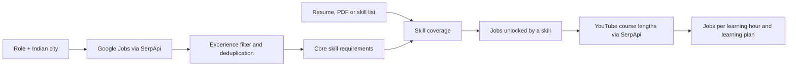

# NextSkill

[](https://github.com/Anand-240/NextSkill/actions/workflows/tests.yml)


Try it live: https://nextskill.streamlit.app

**Learn the one skill that unlocks the most real jobs, in the least time.**

NextSkill turns local job descriptions into a concrete next step. Choose a role and Indian city, add the skills you already have, and see which missing skill could put the most jobs within reach per estimated learning hour. The app shows the job evidence and free course videos behind each recommendation.

## Key findings

- In the saved Bengaluru frontend fresher demo, the profile matches 5 of 19 scored listings. REST API is the fastest win: 7 more matches at 3.12 estimated course hours. React is the biggest unlock: 10 more matches at 5.09 hours. Recommendation confidence is Uncertain.
- Bengaluru sets aside 22 listings that need more experience. Another 23 remain eligible, including 19 with detected core skills.
- In Noida, Data Cleaning is the fastest win: 2 more matches at 1.54 hours. SQL is the biggest unlock: 5 more at 4.34 hours. Recommendation confidence is Uncertain.
- At 5, 10, and 15-hour budgets, Bengaluru's greedy plan gains 7/7, 12/14, and 14/14 matches against the exact best. Noida gains 2/5, 11/11, and 12/12.

## Why it exists

Students and early-career applicants often have to guess what to learn. Job descriptions mention many skills, but a long course list does not answer which skill to learn *next*. NextSkill compares a person's current skills with actual listings for a chosen role and city, then shows one-skill recommendations and an ordered learning plan.

## Try the bundled demo

The bundled Noida and Bengaluru snapshots work **without a SerpApi key** and make no API calls.

```sh
git clone https://github.com/Anand-240/NextSkill.git
cd NextSkill
python3 -m venv .venv
. .venv/bin/activate
pip install -r requirements.txt
streamlit run app.py
```

Open the local URL shown by Streamlit. The Bengaluru frontend demo appears automatically. Choose another role or change the inputs, then press **Find my next skill** to refresh the results. You can replace the sample resume text, enter a comma-separated skill list, or upload a PDF with selectable text. Select an experience level and adjust the readiness threshold if you want to explore different scenarios.

| Saved demo persona | Eligible listings | Jobs with detected core skills | Matches now | Fastest win | Biggest unlock |
|---|---:|---:|---:|---|---|
| Data Analyst, Noida · Excel and basic Python fresher | 20 | 17 | 1 | Data Cleaning, +2 | SQL, +5 |
| Frontend Developer, Bengaluru · HTML, CSS and JavaScript fresher | 23 | 19 | 5 | REST API, +7 | React, +10 |

These job snapshots were retrieved on **2026-10-07 UTC**. The headline reports matching saved listings. Eligible listings pass the experience and date filters; scored listings also have detected core requirements. Matching the threshold does not establish hiring eligibility.


[Noida opportunity curve](screenshots/final_noida_plan.png) · [Bengaluru opportunity curve](screenshots/final_frontend_plan.png) · [Search Replay](screenshots/final_replay.png)

## How it works



1. **Collect listings.** Live mode searches Google Jobs for the role and city, up to three pages. Fresher mode also searches fresher and junior variants. The app merges near-duplicate company/title pairs and shows each query in **Search Replay**.
2. **Find core requirements.** The dictionary extracts named skills from descriptions. A skill is core when it appears in at least **25% of experience-eligible listings** by default; the share is adjustable. Skills are interchangeable only where that listing explicitly offers an “X or Y”, “X, Y, or Z” or slash choice. Naming React alone requires React. Negated skill mentions are excluded from job text and resumes. Broad labels such as “UI/UX” count for matching but are never recommended as a course.
3. **Measure readiness.** A job is within reach when the user has at least **50% of its detected core requirements** by default. The threshold slider is adjustable. Explicit description requirements override title estimates. Fresher wording and zero-year ranges override title fallback. The experience inputs conservatively use the minimum of each band: 0, 1 or 3 years. Jobs requiring more experience are shown separately. Posting ages add elapsed days since retrieval. Listings with no detected core requirement are marked **Unknown** and excluded from readiness counts.
4. **Rank missing skills.** For each missing core skill, NextSkill counts jobs that are outside reach now but would cross the threshold after adding it. It divides that count by an estimated course length. Results include the matching jobs, posting dates, links, course videos, and a two-skill plan.
5. **Build an opportunity curve.** Starting from jobs already within reach, the app repeatedly picks the skill with the most *additional* jobs per learning hour. It stops after five skills or when no skill adds jobs. Only skills with a course duration are used; others appear under **Hours unknown**. A skill-distance chart shows how many listings are zero, one, two, or at least three core skills away.

Course hours are the median length of up to three free YouTube videos with a course-like title and a duration of at least one hour. Titles or channels indicating an unrequested language are excluded before selection and fallback. Unlabelled language remains unknown; this filter cannot verify the audio language. If fewer than two qualify, the app falls back to videos of at least 30 minutes and marks the estimate **low confidence**. The displayed hour range is an approximate ±25% band; it is not a promise of mastery.

## What the saved plans show

| Demo | Opportunity-curve points: cumulative hours → jobs within reach | Greedy vs exact additional jobs at 5h / 10h / 15h |
|---|---|---|
| Noida analyst fresher | Current profile: 1; Data Cleaning 1.54h → 3; SQL 5.89h → 11; Tableau 11.89h → 13 | **2/5** · 11/11 · 12/12 |
| Bengaluru frontend fresher | Current profile: 5; REST API 3.12h → 12; Responsive Design 5.92h → 17; React 11.01h → 19 | 7/7 · **12/14** · 14/14 |

For the quality check, NextSkill tries every subset of the top eight measurable missing skills under 5, 10, and 15-hour budgets. These saved demos have **five** measurable candidate skills in Noida and **three** in Bengaluru. Exact search beats greedy twice. In Noida at five hours, greedy takes Data Cleaning (+2) while SQL alone gives +5. In Bengaluru at ten hours, greedy takes REST API and Responsive Design (+12), while React and Responsive Design give +14. Each budget check reruns greedy under that budget, so it can differ from a prefix of the unrestricted curve. This is a check on these samples and budgets; greedy is not guaranteed to find the best combination.

The app resamples eligible listings **500 times** with a fixed seed. Data Cleaning wins **49.2%** of Noida resamples; REST API wins **63.0%** in Bengaluru (React 27.8%). It also varies each measured skill's hours independently from **0.75x to 1.5x** in 500 seeded draws, checked at thresholds **0.4 / 0.5 / 0.6**, plus the selected threshold if different. At the default threshold this gives **1,500 checks**: the top pick is retained in **86.1%** for Noida and **58.9%** for Bengaluru.

Recommendation confidence uses the **lower of the two shares**: Strong at 85% or more, Likely at 60% or more, otherwise Uncertain. Both demos are therefore **Uncertain**. These labels measure sensitivity, not accuracy or hiring probability. A separate listing-count badge reports High (25+), Medium (12 to 24), or Low (under 12) sample size.

## Why SerpApi is essential

| SerpApi engine | What NextSkill uses it for |
|---|---|
| [`google_jobs`](https://serpapi.com/google-jobs-api) | Local job titles, companies, descriptions, links, posting signals, and pagination. |
| [`youtube`](https://serpapi.com/youtube-search-api) | Beginner-course search results, video lengths, channels, titles, and links. |
| [Account API](https://serpapi.com/account-api) | Credit usage before and after a live run. |

The live product needs current local job and course data; the bundled data exists to make the demo and tests reproducible. Live responses are cached in `cache/`. Searches use a 75-second timeout and do not retry on timeout.

## Data sources

The bundled responses in `demo_data/` and `tests/fixtures/` contain Google Jobs and YouTube results retrieved through SerpApi. Job descriptions belong to their original publishers; video titles, channel names, and links credit their creators. Reports quote these results, and screenshots show the NextSkill interface with that third-party content. Contact emails and phone numbers in the bundled responses are redacted. NextSkill's MIT licence covers its own code, not ownership or relicensing of the source listings, video metadata, logos, or other third-party material; their original rights and terms still apply.

## Use live search locally

1. Copy `.env.example` to `.env` and set `SERPAPI_KEY` to your own key. You can also provide the key through the environment or a private Streamlit secret.
2. Start the app with `streamlit run app.py` and turn on **Live search**.
3. Enter a role and city, add your skills, and press **Find my next skill**. The app shows credit usage and whether each Search Replay entry came from a saved response, local cache, or live request.

Without a key, Live search is disabled and the app says: **“Live search needs a SerpApi key. Demo data is shown.”** The app's demo live-search cap is six attempted requests. `.env` and `cache/` are Git-ignored; never put a key in `demo_data/` or commit it.

For Streamlit Community Cloud, select **`app.py` at the repository root**. The public hosted app runs on bundled demo data only. Do not give the public deployment a SerpApi key or add `SERPAPI_KEY` to its secrets. Live search is for local use with your own key.

## Validation and limitations

- The initial [GREEN validation check](reports/validation_check.md) found **19 / 15 / 19** unique listings for Data Analyst Noida, Python Developer Bengaluru, and Marketing Intern Pune. All had descriptions of at least 300 characters, and YouTube returned parseable durations.
- A small [matcher audit](reports/matcher_audit.md) reported: 16 of 20 sampled matches were correct; after filters, the 16 retained matches were all correct; recall not measured. A later [sentence-level audit](reports/match_sanity_check.md) found no false matches among the saved REST API, Responsive Design, and Data Cleaning listing matches; it lists every triggering source segment.
- The [final report](reports/final_report.md) and [result data](reports/final_results.json) give the current demo figures and the before/after effect of the last matcher fix. The [Batch E report](reports/batch_e_report.md) and [its data](reports/batch_e_results.json) document the corrected matcher, alternatives, experience, language filters, retrieval dates, independent sensitivity checks, and all recomputed cached course estimates. The [Batch D report](reports/batch_d_report.md) records earlier behavior and the last checked credit balance. Earlier [Batch C](reports/batch_c_report.md), [Batch B](reports/batch_b_report.md), and [Batch A](reports/batch_a_report.md) reports document how the model changed.
- Job descriptions rarely separate required from nice-to-have skills. Keyword matching, experience parsing, and the readiness threshold are approximations. Nearby-city listings can appear in a search, and small samples can change the ranking.
- Course length estimates study time only. Some results may cover adjacent topics; review the linked videos. Scanned PDFs need pasted text because the app does not perform OCR.
- **No course or score promises an interview or job.**

## Project structure and tests

| Path | Purpose |
|---|---|
| `app.py` | Streamlit interface, charts, and Search Replay. |
| `engine.py` | Cached SerpApi client, experience filtering, readiness, ranking, planning, and bootstrap. |
| `skills.py` | Canonical skill dictionary, aliases, and context-aware matching. |
| `resume_pdf.py` | Text extraction from PDF resumes. |
| `demo_data/` | Committed job and course responses for key-free Demo mode. |
| `tests/` | Offline unit tests and fixtures. |
| `scripts/` | Development scripts for audits, reports, and screenshots. |
| `reports/`, `screenshots/` | Audits, measurements, and demo evidence. |

Run the offline suite from the repository root:

```sh
python -m unittest discover -s tests -q
```

The suite currently has **46 tests** and makes no SerpApi calls. `.github/workflows/tests.yml` runs it on pushes and pull requests. To capture screenshots locally, install `requirements-dev.txt`, run `python -m playwright install chromium`, start the app, then run `python -m scripts.capture_screenshots final_noida`. Run other development scripts with `python -m scripts.<module>` from the repository root. Playwright is a development dependency, not required to run the app.

**Stack:** Python 3.10+, Streamlit, Altair, pypdf, standard-library HTTP and JSON, and SerpApi. OpenAI Codex and Claude Code assisted with implementation, tests, analysis, and documentation. The running app does not call an LLM.

**Licence:** [MIT](LICENSE).
