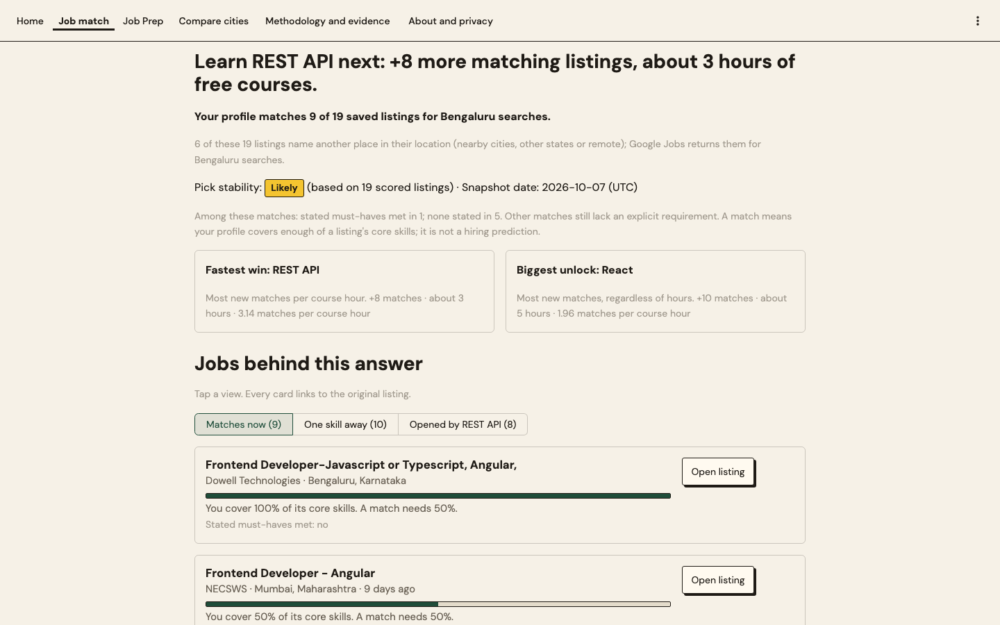
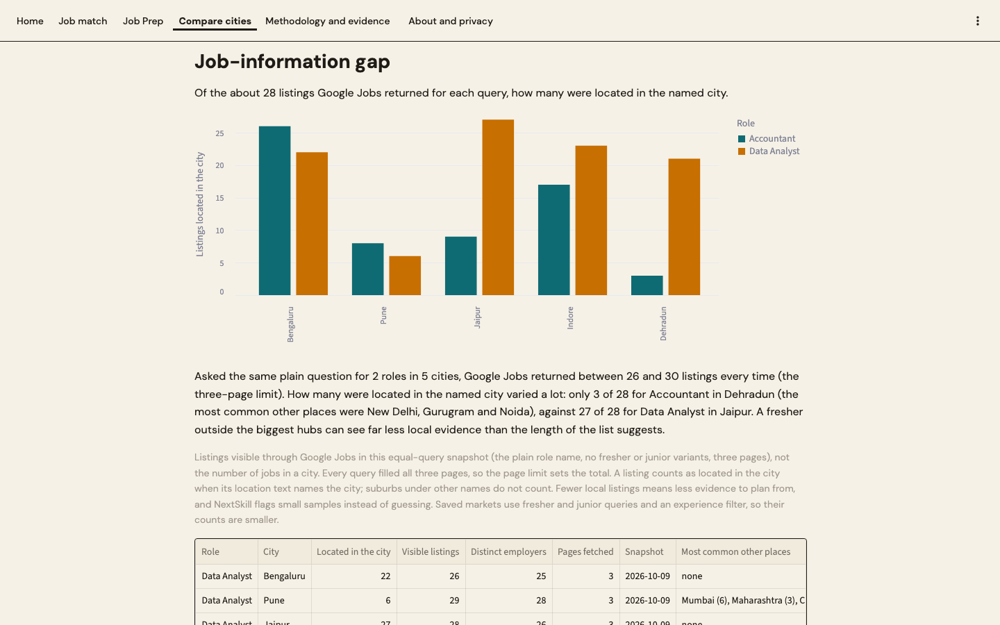
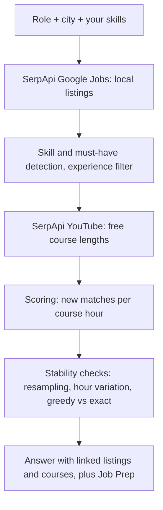
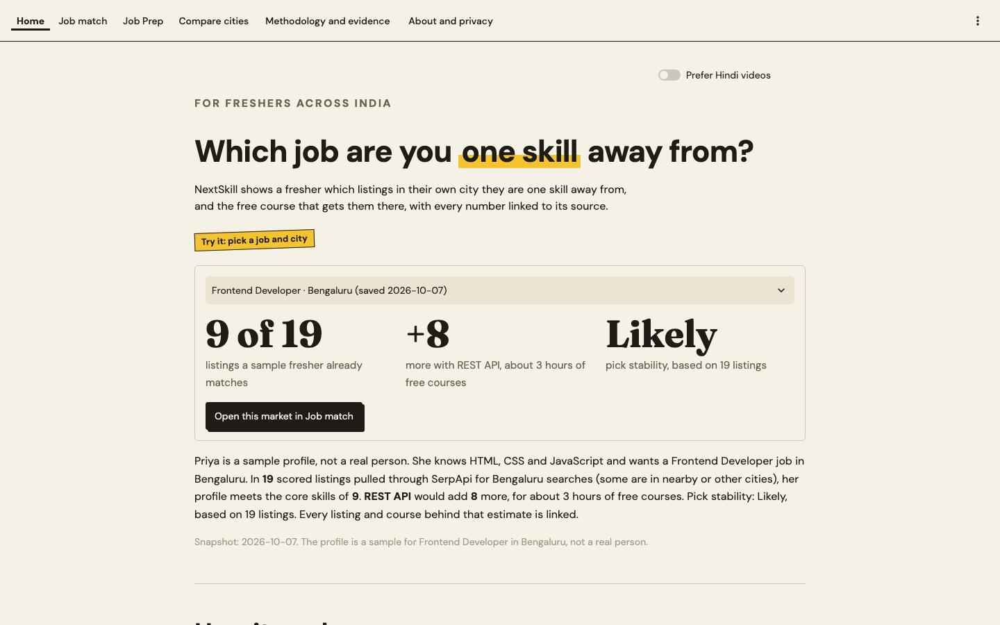
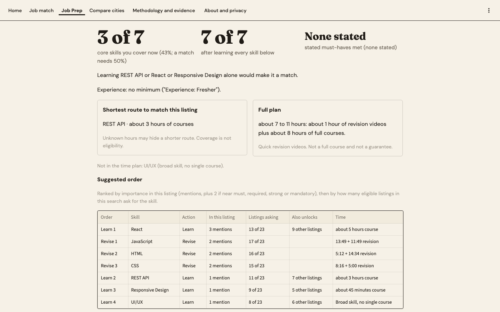

# NextSkill: your next skill, counted from real local job listings.

[](requirements.txt)
[](https://github.com/Anand-240/NextSkill/actions/workflows/tests.yml)
[](LICENSE)

[Demo video](https://youtu.be/dMH1nPUElMM) · [Live app (saved data)](https://nextskill.streamlit.app) · [Methodology](#methodology-and-limitations)

Built for the SerpApi India Hackathon 2026, Knowledge & Public Interest track, by Anand and Anjali.

## In 30 seconds

- **Problem:** a fresher reads job listings that each ask for many skills, and cannot tell which ONE to learn next.
- **What NextSkill does:** for a role and a city it counts which missing skill opens the most matching local listings per
  hour of free course, using SerpApi Google Jobs for the listings and SerpApi YouTube for the course lengths.
- **Proof:** every number links to the listings and the courses behind it, and the answer says how stable it is.
- **Who it is for:** freshers in India, especially outside the biggest hubs, where local evidence is thin.



Watch the 2:49 demo: https://youtu.be/dMH1nPUElMM

The hosted app runs on saved SerpApi responses so it stays free and safe to share; live search runs locally with your own SerpApi key, as shown in the demo at 1:32.

## At a glance

| | |
|---|---|
| Saved markets | 15 role and city pairs across 10 cities, 163 scored listings |
| Main finding | Only 3 of 28 listings for Accountant in Dehradun were located there, against 27 of 28 for Data Analyst in Jaipur |
| SerpApi engines | Google Jobs, YouTube, Account API |
| Early feedback | 4.33 out of 5 from 3 friends (informal, not a study) |
| Quality checks | 128 offline tests and a consistency check, run by CI on every push |
| Needs a key to try | No: the hosted app and local app run on saved data |

## The problem

Choosing what to learn next is a decision made with little local information. The
[ILO and IHD India Employment Report 2024](https://www.ilo.org/publications/india-employment-report-2024-youth-employment-education-and-skills)
examines youth employment, education and skills, and
[UNICEF](https://www.unicef.org/india/economic-opportunities-young-people) describes gaps in job awareness, information and
employment support for young people. These sources motivate the problem; they do not show that NextSkill helps. Our premise
is that a count over the listings in the fresher's own city is a better starting point than a national list of skills
([research notes](research/RESEARCH.md)).

## What we found

Worked example. Priya is a sample profile, not a real person. She knows HTML, CSS and JavaScript and wants a Frontend Developer job in Bengaluru. In **19** scored listings pulled through SerpApi for Bengaluru searches (some are in nearby or other cities), her profile meets the core skills of **9**. **REST API** would add **8** more, for about 3 hours of free courses. Pick stability: Likely, based on 19 listings. Every listing and course behind that estimate is linked.

**The job-information gap.** Asked the same plain question for 2 roles in 5 cities, Google Jobs returned between 26 and 30 listings every time (the three-page limit). How many were located in the named city varied a lot: only 3 of 28 for Accountant in Dehradun (the most common other places were New Delhi, Gurugram and Noida), against 27 of 28 for Data Analyst in Jaipur. A fresher outside the biggest hubs can see far less local evidence than the length of the list suggests.



Sample and date: 10 equal queries (2 roles in 5 cities, the plain role name, up to three pages each),
snapshot 2026-10-09. These are listings visible through Google Jobs, not the number of jobs in a city. Counts and the
full table are in [reports/final_report.md](reports/final_report.md) and [reports/job_gap.json](reports/job_gap.json).

## How it works



- **Fastest win:** the missing skill that adds the most matches per course hour. Only a skill with standard course
  confidence can lead.
- **Biggest unlock:** the skill that adds the most matches, whatever the hours.
- **Pick stability:** Strong, Likely or Uncertain, from resampling the listings and varying course hours. It is not accuracy.
- **Stated must-haves:** listings that say must, mandatory or required are checked separately from the match.
- **Job Prep:** one listing turned into a plan: the shortest route to a match next to the full plan, with revision videos
  for skills you have and full courses for skills you lack.
- **Compare cities:** the same profile across saved cities, plus the job-information gap.

## Screenshots

| Home | Job Prep |
|---|---|
|  |  |

## How SerpApi is used

| Engine | What we request | Feature that depends on it | Without it |
|---|---|---|---|
| [Google Jobs](https://serpapi.com/google-jobs-api) (`engine=google_jobs`) | `q` is the role (plus fresher and junior variants), `location` is "City, India", `gl=in`, `hl=en`, up to 3 pages through `next_page_token` | Job match, Job Prep, Compare cities and the job-information gap: every listing, match, must-have and experience check | No local evidence at all, so nothing to count |
| [YouTube](https://serpapi.com/youtube-search-api) (`engine=youtube`) | `search_query` such as "SQL full course for beginners" with `sp` set to videos over 20 minutes; "SQL revision" with `sp` set to 4 to 20 minutes for Job Prep; `gl=in`, `hl=en` | Course hours, so matches per course hour, the Fastest win, the linked free courses and Job Prep revision videos | A skill has no study-time estimate and the answer falls back to listing counts only |
| [Account API](https://serpapi.com/account-api) (`account.json`) | Remaining searches, read nonfatally | The credit counter on Live search | Live search still works, without a balance |

- **Per-run credit budget:** Live search takes a budget of new searches (default 3) and shows the most it may use before it runs.
- **Response caching:** saved markets are read from `demo_data/` or `cache/` and cost 0 credits; a new request is a credit.
- **Search Replay:** every request is labelled live, cached, saved demo data or skipped by the budget.
- **Redaction:** `api_key` and account email fields and the key value are removed from every saved response, and the
  repository history was scanned for the key.
- Google web search was tried for NPTEL and SWAYAM pages and dropped; nothing depends on it. This build recorded 106 SerpApi search attempts (61 Google Jobs, 37 YouTube, 8 Google web search) in reports/build_usage.json; the Account API figures are in docs/BUILD_LOG.md.

## Tested with users

**Early feedback.** Informal check: 3 friends (students and freshers) tried NextSkill and rated it 4.33 out of 5 on average (individual ratings 4, 4 and 5). They said it was useful, and their main suggestion was a mobile app, since most freshers look for jobs on their phones. This was not a structured study, so we report no further scores.

- Ratings are recorded in [evaluation/informal_feedback.json](evaluation/informal_feedback.json). Three friendly raters are
  early feedback, not evidence of accuracy or learning outcomes.
- Hand-labelled accuracy: In progress. The hand-labelled evaluation has no results yet, so no figure is claimed.

The only accuracy check so far was written by the developer: Precision before: 80.0% (16/20). Precision after: 100.0% on retained sampled matches. The matching rules were changed after
seeing those 20 matches, so the second figure is not an independent measure and recall was not measured
([matcher audit](reports/matcher_audit.md), [initial API validation](reports/validation_check.md)). A 20-listing labelling kit
and a user-test sheet are in [evaluation/](evaluation/README.md).

## Features

- **Home:** one saved market with the headline numbers for a sample profile.
- **Job match:** tap skills, paste a resume or upload a PDF; choose experience level and match threshold; see the Fastest win
  next to the Biggest unlock, the listings behind each, the free courses, and how the pick was checked.
- **Job Prep:** pick one listing and get the shortest route and the full plan, revise and learn lists with time estimates.
- **Compare cities:** the same profile across saved cities, and the job-information gap chart and table.
- **Live search:** a new role and city through SerpApi with a per-run budget, Search Replay and a credit counter (local only,
  hidden without a key).
- **Methodology and evidence:** what the numbers mean, the jobs-per-hour comparison, validation, user test, limitations, sources.
- **About and privacy:** what happens to a resume, data sources, licence and AI tools.
- **Prefer Hindi videos:** a switch that prefers Hindi videos where they pass the same filters; the interface is English.

## What's next

Based on the early feedback, the next step is a mobile app. The site already fits a phone screen (checked at 390 px wide);
a dedicated mobile app is the step after that. Then:

- Search any city without needing your own SerpApi key (a hosted live mode with a rate-limited key).
- Simple Hindi and English answers, with human-reviewed Hindi labels (today the interface is English and only videos can be Hindi).
- Saved progress and weekly alerts for new matching jobs.
- Independent hand labels and a structured user test.
- NPTEL and SWAYAM courses, once a reliable source exists.

## Quick start

Prerequisite: Python 3.11 or newer (CI runs 3.11).

```sh
git clone https://github.com/Anand-240/NextSkill.git
cd NextSkill
python3 -m venv .venv
. .venv/bin/activate
pip install -r requirements.txt
cp .env.example .env    # optional: add your own SerpApi key as SERPAPI_KEY
streamlit run app.py    # then open http://localhost:8501
```

Without a key the app runs on the saved data and hides Live search. The public hosted app must never receive a key; `.env`
and `cache/` are ignored by git. PDF resumes need selectable text; scanned PDFs need pasted text.

Run tests (all offline, no key needed):

```sh
python -m unittest discover -s tests -q    # 128 tests
python -m scripts.check_consistency        # generated numbers and documents agree
```

## For judges: where to look

| Criterion | Evidence |
|---|---|
| Idea strength | One question, which ONE skill to learn next, answered by counting, and the job-information gap: [What we found](#what-we-found) |
| Originality | Local job demand combined with free-course length into matches per course hour, with honest pick stability: [How it works](#how-it-works), baseline comparison in [reports/final_report.md](reports/final_report.md) |
| Technical complexity | Resampling and hour variation in [engine.py](engine.py) (`bootstrap_confidence`, `assess_robustness`); greedy vs exact (`greedy_opportunity`, `exact_opportunity`); must-have parser (`stated_must_haves`, `must_have_status`); caching, budget and redaction (`SerpClient.search`, `_scrub`); [scripts/check_consistency.py](scripts/check_consistency.py); 128 tests; [CI](.github/workflows/tests.yml) |
| Usefulness | One clear next step with linked free courses ([Features](#features)), the Job Prep plan ([job_prep.py](job_prep.py)), and [Tested with users](#tested-with-users) |
| Meaningful SerpApi usage | [How SerpApi is used](#how-serpapi-is-used); Demo at 1:32 shows a live Lucknow search; the Account API credit count drops from 131 to 128 ([demo video](https://youtu.be/dMH1nPUElMM)) |

## Methodology and limitations

- **Match:** the profile covers at least the selected share (default 50%) of a listing's core skills.
  A core skill is one asked for by at least 25% of the scored listings. A match is not hiring eligibility.
- **Course hours:** the median length of up to three free videos whose title names the skill. It is not time to mastery.
- **Small samples:** each market is a few dozen saved listings in one city. Pick stability is Strong in 0, Likely in 3 and Uncertain in 12 markets; 8 markets are flagged as limited data. The example profile matched between 0% (Data Analyst, Indore) and 55% (Frontend Developer, Hyderabad) of scored listings.
- **Nearby cities:** Google Jobs returns listings from other places for a city search; every market counts these and says so.
- **Not a prediction:** nothing here measures learning or hiring outcomes.
- Skill vocabulary covers tech, data, marketing, finance and design; required versus preferred wording is parsed imperfectly.

Full definitions are on the Methodology and evidence page of the app and in [docs/BUILD_LOG.md](docs/BUILD_LOG.md).

## Project structure

```text
app.py            Streamlit entry point and page navigation
engine.py         SerpApi client, listing parsing, matching, scoring, stability checks
skills.py         Skill vocabulary and detection
job_prep.py       Job Prep plans: revision and learning, shortest route
findings.py       Headline findings and tables shared by the site and documents
views/            One file per page
demo_data/        Saved, redacted SerpApi responses behind the hosted app
scripts/          Result builder, consistency check, evaluation and document generators
tests/            Offline unit tests
reports/          Generated results (final_results.json, job_gap.json) and reports
evaluation/       Hand-label and user-test sheets
research/         Problem evidence, API contracts, landscape notes
docs/             Build log and README screenshots
screenshots/      Site screenshots at desktop and phone width
.github/          CI: offline tests and the consistency check
```

## Privacy and data

Resume text is read in memory and never written to disk or sent to SerpApi; queries contain only the role, the city and skill
names. Saved responses are redacted. Job descriptions and video metadata remain their publishers' content and every result
links back to its source. Streamlit and its host may keep session memory or logs, so do not use the public demo for sensitive
resumes.

## Built with

Python, Streamlit, Altair, pandas, pypdf, SerpApi (Google Jobs, YouTube, Account API), unittest, GitHub Actions.

## Team

Anand ([Anand-240](https://github.com/Anand-240)) and Anjali.

## AI tools disclosure

We (Anand and Anjali) designed and built NextSkill: the idea, research, data collection, product decisions and the demo. AI coding assistants (OpenAI Codex, Claude Code) helped write parts of the code, tests and documentation under our direction, and Claude helped us review plans. The running app does not call an LLM.

## Development timeline

Built for the SerpApi India Hackathon 2026; the first commit is from October 8, 2026 ([docs/BUILD_LOG.md](docs/BUILD_LOG.md)).

- October 8: hosted demo with offline CI, Bengaluru and Noida demos, matcher audit and negation fixes.
- October 9: trust fixes, 15 saved markets, revision videos, Job Prep, a seven-page site, Hindi video preference, evidence kits.
- October 9, evening: stricter headline rule, pick stability, the job-information gap and the baseline comparison.
- October 10: visual redesign, live credit counter, a final fix batch and the pre-submission audit.

## License

[MIT](LICENSE). The licence covers our code, not third-party listing or video content.

## Acknowledgements

[SerpApi](https://serpapi.com) for the search data and the hackathon, the publishers of the job listings, and the YouTube
course creators, who are credited by link wherever a course appears in the app.
