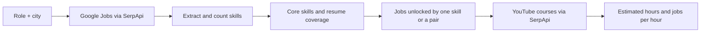
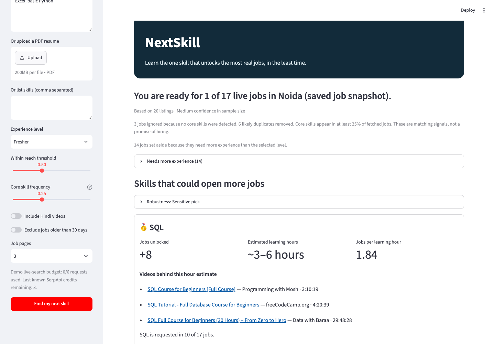
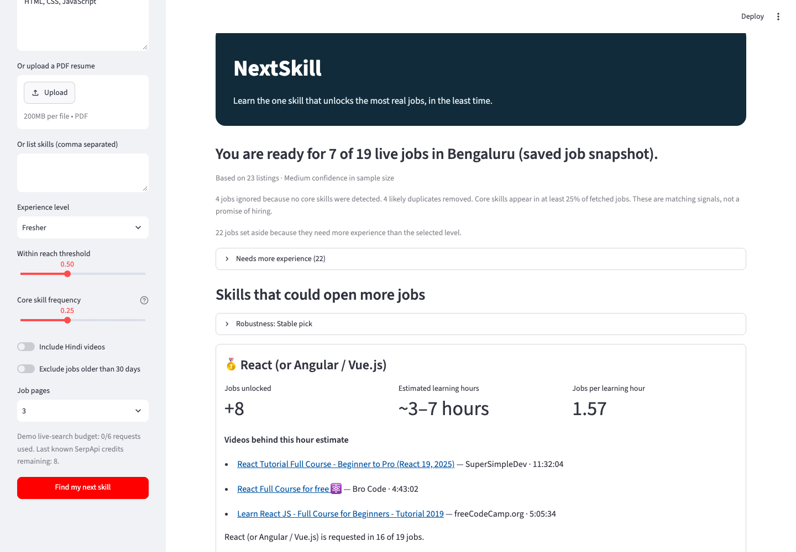

# NextSkill

**Learn the one skill that unlocks the most real jobs, in the least time.**

## The problem

Students in smaller cities often guess what to learn next. Job descriptions list many skills, and a long list of courses does not answer the useful question: which **one** skill would put more nearby jobs within reach?

## How it works

NextSkill searches local Google Jobs listings, sets aside jobs above the selected experience level, extracts named skills, and marks a requirement as *core* when it appears in at least 25% of the eligible jobs. Fresher searches combine the base role with `<role> fresher` and `Junior <role>` first pages, then remove duplicate listings. The Search Replay shows which query produced each listing. It compares core requirements with a pasted resume, uploaded PDF, or manual skill list. BI tools, frontend frameworks, cloud providers, and explicit “X or Y” wording count as alternatives. For each missing, teachable skill, it counts jobs that cross the readiness threshold if that skill is added. It estimates study time from free YouTube courses and ranks by jobs unlocked per learning hour. A two-skill plan is also shown.



The default readiness threshold is **50%**. The slider lets users choose a different threshold. Broad terms such as “Data Analysis” can contribute to coverage, but are excluded from recommendations. Listings with no detected core skills are ignored. Experience parsing is conservative: numeric minimums and seniority words in titles are used; ambiguous listings remain eligible. The robustness panel checks thresholds **0.4 / 0.5 / 0.6** and study-time multipliers **0.5 / 1.5**. The visible learning-hour range is an approximate ±25% band around the median course length.

## Why SerpApi is essential

The product needs current, local job descriptions and current free-course results. Without those two feeds, it cannot say which skills appear in jobs or estimate learning hours.

| SerpApi engine | Use |
|---|---|
| `google_jobs` | Fetch job titles, companies, descriptions, links, posting dates, and pagination for the selected Indian city. |
| `youtube` | Find free beginner courses and parse each video result's `length`, title, channel, and link. |

The free [Account API](https://serpapi.com/account-api) checks credit usage before and after a live run. Queries use the documented [Google Jobs](https://serpapi.com/google-jobs-api) and [YouTube](https://serpapi.com/youtube-search-api) parameters. YouTube's `sp` long-video filter helps narrow results; the app also checks titles and durations itself.

## Example output

With fresher query expansion, the saved Noida demo for an Excel and basic Python fresher has **20 eligible listings**, **17** with detected core requirements, and **1/17** within reach; **14** listings need more experience. **SQL** could unlock **8** jobs. Its rank is **Sensitive pick** because Power BI leads at the 0.6 readiness threshold. The saved Bengaluru demo for an HTML/CSS/JavaScript fresher has **23 eligible listings**, **19** with detected core requirements, and **7/19** within reach; **22** need more experience. **React (or Angular / Vue.js)** could unlock **8** jobs and is a **Stable pick** across checked settings. These are saved job snapshots, not a current live search.





The [Batch B report](reports/batch_b_report.md) contains the 15-listing experience audit, search counts and new fresher results. The [Batch A report](reports/batch_a_report.md) preserves the previous persona comparison.

The [Search Replay screenshot](screenshots/batch_b_replay.png) shows cached query variants and listing origins.

## Validation

- The initial **GREEN** check found **19 / 15 / 19** unique listings for Data Analyst Noida, Python Developer Bengaluru, and Marketing Intern Pune; all **19 / 15 / 19** had descriptions of at least 300 characters. YouTube returned parseable durations for the checked videos. See the [validation report](reports/validation_check.md).
- A 20-match, hand-reviewed skill audit improved precision from **16/20 (80%)** to **16/16 retained matches (100%)** after context filters. See the [matcher audit](reports/matcher_audit.md). This small audit does not measure recall.
- Requiring course-like titles and longer videos changed the saved Power BI learning estimate from **~0.51 to ~3.68 hours**.
- On the same Noida resume at a 0.4 threshold, core-skill coverage changed readiness from **1/16 to 10/17** usable jobs. At the newer default 0.5 threshold, the analyst fresher is ready for **2/17** and the frontend fresher for **8/28** jobs on their matching roles.
- Batch A adds experience filtering and substitute skills. At the 0.5 threshold, the saved analyst fresher changes from **2/17** to **1/8** usable jobs (**9** experience exclusions); the frontend fresher changes from **8/28** to **2/11** (**17** exclusions). These denominators changed because ineligible jobs are now shown separately. Both demo top picks are labelled **Stable pick** across the checked settings, among skills with cached course durations.
- Batch B spot-checked 15 previous experience exclusions: **14/15 (93.3%)** had defensible trigger evidence; after removing one malformed “25 Years” trigger, **14/14 retained (100%)** did. This is evidence precision on a small sample, not a measure of actual hiring eligibility. Fresher query expansion changed the current cached demos to **1/17 ready** for Noida and **7/19 ready** for Bengaluru, with **20** and **23** eligible listings respectively. The four new Google Jobs searches used four credits, leaving eight.

## Limitations

- Learning hours are estimates from free course lengths; watching a course does not prove mastery.
- Job descriptions rarely separate required skills from nice-to-have skills, so keyword matches and readiness are approximate.
- City samples can be small. The app warns when fewer than 12 distinct jobs are found; Noida's third page returned no listings in the Phase 2 check.
- A job being “within reach” does **not** promise an interview or a job.
- Broad course queries can return adjacent topics; review the linked videos before following a plan.
- Experience minimums inferred from requirement-style text or titles can miss unusual wording, and “3+ years” is an open-ended input bucket. An unlabelled job is kept eligible. Search locations can include nearby cities.
- PDF extraction works on PDFs with selectable text. Scanned image PDFs need pasted text; no OCR is included.
- The robustness label uses only skills with cached, parseable course durations. The confidence badge measures sample size, not prediction accuracy.

## Setup

Requires Python 3.10+.

```sh
cd nextskill
python3 -m venv .venv
.venv/bin/pip install -r requirements.txt
cp .env.example .env
# Put your SerpApi key in .env as SERPAPI_KEY=your_key
.venv/bin/streamlit run app.py
```

**Demo data** is selected by default and reads bundled JSON from `demo_data/`, including Noida and Bengaluru base jobs, fresher/junior variants and YouTube course durations. It works on a fresh clone without `.env` or `cache/`, and makes no SerpApi calls. Choose a demo role, use the sample resume, paste your own, list skills, or upload a text-based PDF; select an experience level and then **Find my next skill**. Without a key, Live search is disabled and the app says “Live search needs a SerpApi key. Demo data is shown.” With a key in `.env`, the `SERPAPI_KEY` environment variable or Streamlit secrets, **Live search** lets you enter another role and city. It spends credits only when you start a search; the sidebar shows the live request budget and the app shows account credits before and after. Live responses are cached and replayed on repeated queries. The demo live-request cap is six attempted searches, with a 75-second timeout and no retry on timeout. `.env` and `cache/` are Git-ignored.

## Streamlit Community Cloud

Deploy `app.py` from the repository root. Demo mode requires no secrets. To enable Live search, add `SERPAPI_KEY` as a private app secret in Streamlit Community Cloud. Do not put the key in the repository.

## Tech stack and tests

Python standard library for the engine and HTTP client, Streamlit for the UI, pypdf for resume PDFs, and local JSON fixtures for offline tests. To run the tests from `nextskill/`:

```sh
PYTHONPATH=. .venv/bin/python -m unittest discover -s tests -q
```

The test suite runs without SerpApi calls. Playwright is used only to capture screenshots for the demo; install `requirements-dev.txt` for that workflow.

GitHub Actions runs the offline suite on every push and pull request using `.github/workflows/tests.yml`.

## AI tools used

OpenAI Codex assisted with implementation, test writing, analysis, and documentation. The running app does not call an LLM. Skill matching and ranking are deterministic Python code.

## Licence

[MIT](LICENSE).
