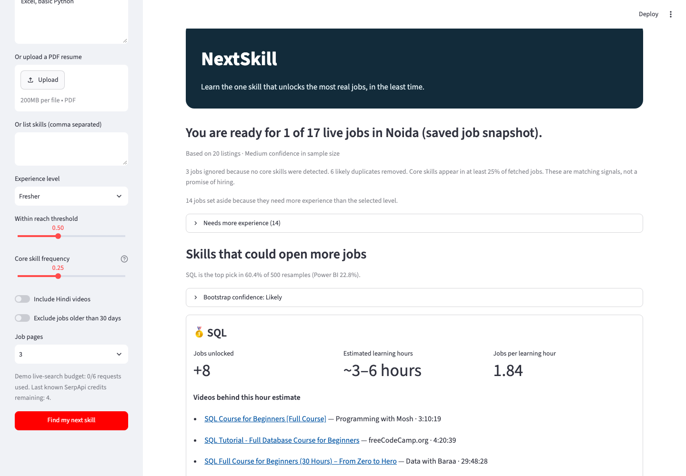
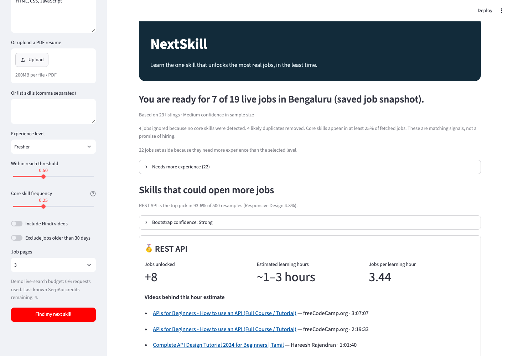
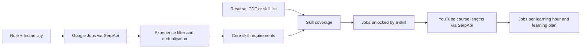

# NextSkill

**Learn the one skill that unlocks the most real jobs, in the least time.**

NextSkill turns local job descriptions into a concrete next step. Choose a role and Indian city, add the skills you already have, and see which missing skill could put the most jobs within reach per estimated learning hour. The app shows the job evidence and free course videos behind each recommendation.

## Why it exists

Students and early-career applicants often have to guess what to learn. Job descriptions mention many skills, but a long course list does not answer which skill to learn *next*. NextSkill compares a person's current skills with actual listings for a chosen role and city, then shows one-skill recommendations and an ordered learning plan.

## Try the bundled demo

The bundled Noida and Bengaluru snapshots work **without a SerpApi key** and make no API calls.

```sh
cd nextskill
python3 -m venv .venv
. .venv/bin/activate
pip install -r requirements.txt
streamlit run app.py
```

Open the local URL shown by Streamlit. Leave **Demo data** on, choose either role, and press **Find my next skill**. You can replace the sample resume text, enter a comma-separated skill list, or upload a PDF with selectable text. Select an experience level and adjust the readiness threshold if you want to explore different scenarios.

| Saved demo persona | Eligible listings | Jobs with detected core skills | Ready now | Top scored skill | Jobs it could unlock |
|---|---:|---:|---:|---|---:|
| Data Analyst, Noida · Excel and basic Python fresher | 20 | 17 | 1 | SQL | 8 |
| Frontend Developer, Bengaluru · HTML, CSS and JavaScript fresher | 23 | 19 | 7 | REST API | 8 |

These are **saved job snapshots**, not a current live search. “Within reach” is a skill-coverage estimate, not a hiring prediction.





[Noida opportunity curve](screenshots/batch_d_noida_plan.png) · [Bengaluru opportunity curve](screenshots/batch_d_frontend_plan.png) · [Search Replay](screenshots/batch_b_replay.png)

## How it works



1. **Collect listings.** Live mode searches Google Jobs for the role and city, up to three pages. Fresher mode also searches fresher and junior variants. The app merges near-duplicate company/title pairs and shows each query in **Search Replay**.
2. **Find core requirements.** The dictionary extracts named skills from descriptions. A skill is core when it appears in at least **25% of experience-eligible listings** by default; the share is adjustable. BI tools, frontend frameworks, cloud providers, and explicit “X or Y” wording can satisfy the same requirement. Broad labels such as “UI/UX” count for matching but are never recommended as a course.
3. **Measure readiness.** A job is within reach when the user has at least **50% of its detected core requirements** by default. The threshold slider is adjustable. Jobs requiring more experience are shown separately. Listings with no detected core requirement are marked **Unknown** and excluded from readiness counts.
4. **Rank missing skills.** For each missing core skill, NextSkill counts jobs that are outside reach now but would cross the threshold after adding it. It divides that count by an estimated course length. Results include the matching jobs, posting dates, links, course videos, and a two-skill plan.
5. **Build an opportunity curve.** Starting from jobs already within reach, the app repeatedly picks the skill with the most *additional* jobs per learning hour. It stops after five skills or when no skill adds jobs. Only skills with a course duration are used; others appear under **Hours unknown**. A skill-distance chart shows how many listings are zero, one, two, or at least three core skills away.

Course hours are the median length of up to three free YouTube videos with a course-like title and a duration of at least one hour. If fewer than two qualify, the app falls back to videos of at least 30 minutes and marks the estimate **low confidence**. The displayed hour range is an approximate ±25% band; it is not a promise of mastery.

## What the saved plans show

| Demo | Opportunity-curve points: cumulative hours → jobs within reach | Greedy vs exact additional jobs at 5h / 10h / 15h |
|---|---|---|
| Noida analyst fresher | Today: 1; SQL 4.34h → 9; Data Cleaning 7.84h → 11; Power BI 11.52h → 13 | 8/8 · **10/11** · 12/12 |
| Bengaluru frontend fresher | Today: 7; REST API 2.33h → 15; Responsive Design 5.13h → 18; React 10.22h → 19 | 8/8 · **11/12** · 12/12 |

For the quality check, NextSkill tries every subset of the top eight measurable missing skills under 5, 10, and 15-hour budgets. These saved demos have **four** measurable candidate skills in Noida and **three** in Bengaluru. At 10 hours, the greedy plan reaches **90.9%** and **91.7%** of the exact additional-job gain respectively. This is a check on these samples and budgets; greedy is not guaranteed to find the best combination.

The app also resamples the eligible listings **500 times** with a fixed seed and recomputes the top pick. SQL wins **60.4%** of Noida resamples (**Likely**); REST API wins **93.6%** of Bengaluru resamples (**Strong**). Labels are **Strong** at 85% or more, **Likely** from 60% to below 85%, and **Uncertain** below 60%. They describe sensitivity to the sampled listings, not the chance of getting hired. A separate listing-count badge reports High (25+), Medium (12–24), or Low (under 12) sample size.

## Why SerpApi is essential

| SerpApi engine | What NextSkill uses it for |
|---|---|
| [`google_jobs`](https://serpapi.com/google-jobs-api) | Local job titles, companies, descriptions, links, posting signals, and pagination. |
| [`youtube`](https://serpapi.com/youtube-search-api) | Beginner-course search results, video lengths, channels, titles, and links. |
| [Account API](https://serpapi.com/account-api) | Credit usage before and after a live run. |

The live product needs current local job and course data; the bundled data exists to make the demo and tests reproducible. Live responses are cached in `cache/`. Searches use a 75-second timeout and do not retry on timeout.

## Use live search

1. Copy `.env.example` to `.env` and set `SERPAPI_KEY` to your own key. You can also provide the key through the environment or a private Streamlit secret.
2. Start the app with `streamlit run app.py` and turn on **Live search**.
3. Enter a role and city, add your skills, and press **Find my next skill**. The app shows credit usage and whether each Search Replay entry came from a saved response, local cache, or live request.

Without a key, Live search is disabled and the app says: **“Live search needs a SerpApi key. Demo data is shown.”** The app's demo live-search cap is six attempted requests. `.env` and `cache/` are Git-ignored; never put a key in `demo_data/` or commit it.

For Streamlit Community Cloud, select **`app.py` at the repository root**. Demo mode needs no secrets. Add `SERPAPI_KEY` as a private app secret only if you want Live search.

## Validation and limitations

- The initial [GREEN validation check](reports/validation_check.md) found **19 / 15 / 19** unique listings for Data Analyst Noida, Python Developer Bengaluru, and Marketing Intern Pune. All had descriptions of at least 300 characters, and YouTube returned parseable durations.
- A small [matcher audit](reports/matcher_audit.md) improved precision from **16/20 (80%)** reviewed matches to **16/16 retained matches (100%)** after context filters. It did not measure recall. A later [sentence-level audit](reports/match_sanity_check.md) found no false matches among the saved REST API, Responsive Design, and Data Cleaning listing matches; it lists every triggering source segment.
- The [Batch D report](reports/batch_d_report.md) contains course sources, exact-budget comparisons, bootstrap shares, and the last checked credit balance. Earlier [Batch C](reports/batch_c_report.md), [Batch B](reports/batch_b_report.md), and [Batch A](reports/batch_a_report.md) reports document how the model changed.
- Job descriptions rarely separate required from nice-to-have skills. Keyword matching, experience parsing, and the readiness threshold are approximations. Nearby-city listings can appear in a search, and small samples can change the ranking.
- Course length estimates study time only. Some results may cover adjacent topics; review the linked videos. Scanned PDFs need pasted text because the app does not perform OCR.
- **No course or score promises an interview or job.**

## Project structure and tests

| Path | Purpose |
|---|---|
| `app.py` | Streamlit interface, charts, and Search Replay. |
| `engine.py` | Cached SerpApi client, experience filtering, readiness, ranking, planning, and bootstrap. |
| `skills.py` | Canonical skill dictionary, aliases, and context-aware matching. |
| `resume_pdf.py` | Text extraction from PDF resumes. |
| `demo_data/` | Committed job and course responses for key-free Demo mode. |
| `tests/` | Offline unit tests and fixtures. |
| `reports/`, `screenshots/` | Audits, measurements, and demo evidence. |

Run the offline suite from the repository root:

```sh
python -m unittest discover -s tests -q
```

The suite currently has **33 tests** and makes no SerpApi calls. `.github/workflows/tests.yml` runs it on pushes and pull requests. To capture screenshots locally, install `requirements-dev.txt`; Playwright is a development dependency, not required to run the app.

**Stack:** Python 3.10+, Streamlit, Altair, pypdf, standard-library HTTP and JSON, and SerpApi. OpenAI Codex assisted with implementation, tests, analysis, and documentation. The running app does not call an LLM.

**Licence:** [MIT](LICENSE).
